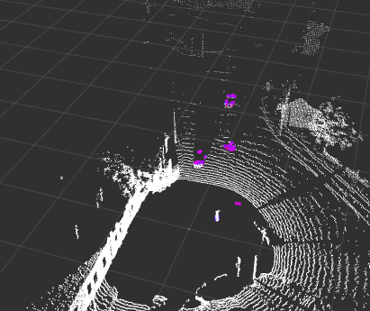

# `arj_simple_perception` ROS 2 package

Simple (eg. crop box based) LIDAR filtering.


## Build this ROS 2 package
``` r
cd ~/ros2_ws
MAKEFLAGS="-j4" colcon build --packages-select arj_simple_perception --cmake-args -DCMAKE_BUILD_TYPE=Release
```
Note that `colcon build --packages-select arj_simple_perception` also works, it's jus a bit slower build on some devices.

## Run

Some possible options:

``` r
ros2 run arj_simple_perception lidar_filter_simple
ros2 run arj_simple_perception lidar_filter_simple_param
ros2 launch arj_simple_perception run_rviz1.launch.py
ros2 launch arj_simple_perception run_all.launch.py
ros2 launch arj_simple_perception filter_a.launch.py  \
    cloud_topic:=/lexus3/os_center/points \
    cloud_frame:=lexus3/os_center_a_laser_data_frame
```

> [!NOTE]  
> Note that `cloud_frame` is optional and defaults to the frame of the input point cloud.


## Remarks

In VS code it is advised to add the following to include path:

``` r
${workspaceFolder}/**
/opt/ros/humble/include/**
/usr/include/pcl-1.12/**
/usr/include/eigen3/**
```

If you are not sure where your header files are use e.g.:
``` r
find /usr/include -name point_cloud.h
find /usr/include -name crop_box.h
```
