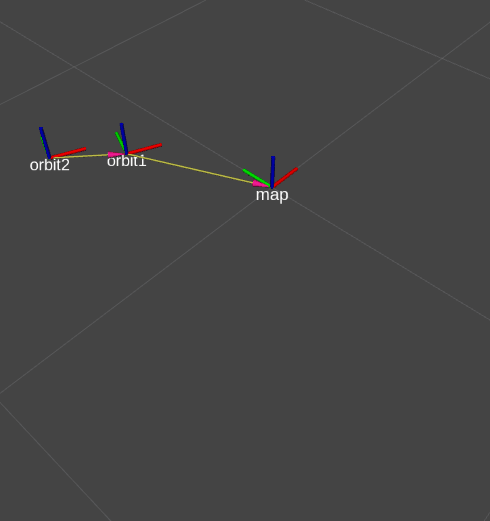

# `arj_transforms_cpp` ROS 2 package


## Build this ROS 2 package
``` r
cd ~/ros2_ws
colcon build --packages-select arj_transforms_cpp
```




``` r
ros2 run tf2_ros static_transform_publisher --x 1.0 --y 0.2 --z 1.4 --qx 0.0 --qy 0.0 --qz 0.0 --qw 1.0 --frame-id orbit2 --child-frame-id orbit3
```

``` r
ros2 run rqt_reconfigure rqt_reconfigure
```

``` r
 ros2 topic pub --rate 40 /marker_topic2 visualization_msgs/msg/Marker '{header: {frame_id: "orbit2"}, ns: "markers", id: 1, type: 2, action: 0, pose: {position: {x: 0.0, y: 0.0, z: 0.0}, orientation: {x: 0.0, y: 0.0, z: 0.0, w: 1.0}}, scale: {x: 1.0, y: 1.0, z: 1.0}, color: {r: 0.2, g: 0.4, b: 0.2, a: 1.0}}'
 ```